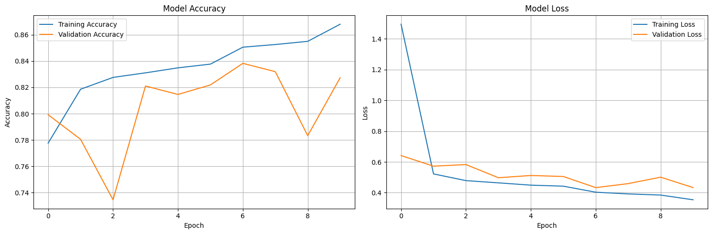

# IMDB Movie Review Sentiment Analysis


This repository contains a deep learning project for classifying IMDB movie reviews as either positive or negative. The entire workflow, from data preprocessing to model training and evaluation, is contained within the main Jupyter Notebook. The model uses a hybrid CNN-BiLSTM architecture with pre-trained GloVe embeddings.



## 📝 Table of Contents
- [Project Overview](#project-overview)
- [Model Architecture](#model-architecture)
- [Repository Contents](#repository-contents)
- [Setup & Usage](#setup--usage)
- [Download the Saved Model](#download-the-saved-model)
- [Acknowledgments](#acknowledgments)

## 📊 Project Overview

This project implements a sentiment analysis model to determine whether a movie review is positive or negative. The core components are:
- **Text Preprocessing**: Cleaning raw text by removing HTML tags, punctuation, numbers, and stopwords.
- **Word Embeddings**: Utilizing pre-trained 100-dimensional GloVe embeddings to represent words as dense vectors, capturing semantic meaning.
- **Hybrid Model**: A deep learning model that combines Convolutional Neural Networks (CNNs) for feature extraction and Bidirectional LSTMs (BiLSTMs) for understanding sequential context.
- **Training & Evaluation**: The model is trained on the popular IMDB dataset and evaluated on a hold-out test set.
- **Inference**: The notebook includes code to test the trained model on new, unseen reviews.

## 🧠 Model Architecture

The model is a Sequential Keras model built with a hybrid architecture designed to effectively process textual data.

1.  **Embedding Layer**: Initializes word representations using pre-trained GloVe vectors.
2.  **Conv1D Layers**: Extract local n-gram features from the text.
3.  **Bidirectional LSTM Layer**: Captures long-range dependencies and contextual information from the entire review.
4.  **Dense Layers**: Fully connected layers for final classification, with Dropout and Batch Normalization for regularization.
5.  **Output Layer**: A single neuron with a sigmoid activation function to output a probability score for the "positive" class.


## 📂 Repository Contents

This repository has a flat structure, with all key assets in the root directory.

- `IMDB PROJECT.ipynb`: The main Jupyter Notebook containing all the code for data loading, preprocessing, model definition, training, and prediction.
- `README.md`: This file, providing an overview and instructions for the project.
- `model_architecture.png`: A diagram visualizing the neural network architecture.
- `training_history.png`: A plot showing the model's accuracy and loss during training.
- `tokenizer.pickle`: The saved Keras tokenizer fitted on the training data. This is required to process new text for prediction.
- **`model.keras` (External)**: The trained model file is not in this repository due to its size. See the section below on how to download it.

## 🚀 Setup & Usage

To run this project, follow these steps:

**1. Clone the repository:**
```bash
git clone https://github.com/MohanadMetrash/IMDB-Sentiment-Analysis.git
cd YOUR_REPOSITORY_NAME
```

**2. Install Dependencies:**
It is highly recommended to use a virtual environment. The required libraries are listed in the import cells of the notebook. You can install them using pip:
```bash
pip install pandas numpy scikit-learn tensorflow keras nltk seaborn matplotlib
```

**3. Download NLTK Stopwords:**
Run the following commands in a Python interpreter or a notebook cell:
```python
import nltk
nltk.download('stopwords')
```

**4. Download Datasets and Embeddings:**
You will need to download the following files and place them in the main project directory:
- **IMDB Dataset**: Download `a1_IMDB_Dataset.csv` and `a3_IMDb_Unseen_Reviews.csv`.
- **GloVe Embeddings**: Download `glove.6B.zip` from the [official GloVe website](https://nlp.stanford.edu/projects/glove/). Unzip it and place the `glove.6B.100d.txt` file in the project directory.

**5. Download the Pre-trained Model:**
Follow the instructions in the [Download the Saved Model](#download-the-saved-model) section below to get the `model.keras` file.

**6. Run the Notebook:**
Once all files are in place, open `IMDB PROJECT.ipynb` in Jupyter Lab or Jupyter Notebook and run the cells sequentially. You can either re-train the model or use the pre-trained model for prediction.

## Download the Saved Model

The trained model file (`model.keras`) is too large for this GitHub repository. You can download it directly from the link below.

- **Download Link:** **[Google Drive - IMDB Model]([https://drive.google.com/drive/folders/1uT9U8_0uFbHsvW9Sk_4tqqk3iG0FbL-0])**

After downloading, place the `model.keras` file in the main project directory alongside `IMDB PROJECT.ipynb` and `tokenizer.pickle`. You can then use the final cells of the notebook to load the model and make predictions without needing to re-train it.


## 🙏 Acknowledgments
- The [IMDb Large Movie Review Dataset](https://ai.stanford.edu/~amaas/data/sentiment/).
- The [GloVe: Global Vectors for Word Representation](https://nlp.stanford.edu/projects/glove/) project by Stanford University.
